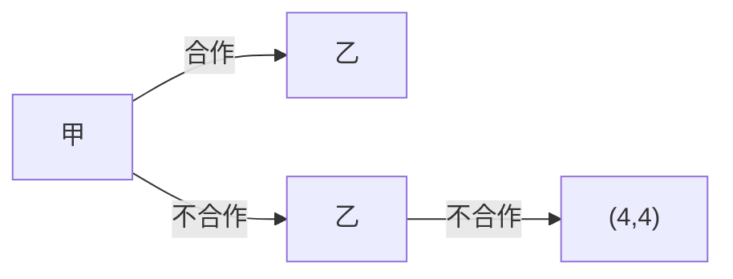
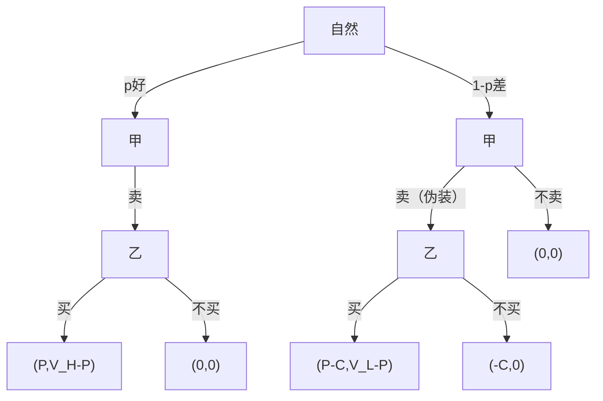
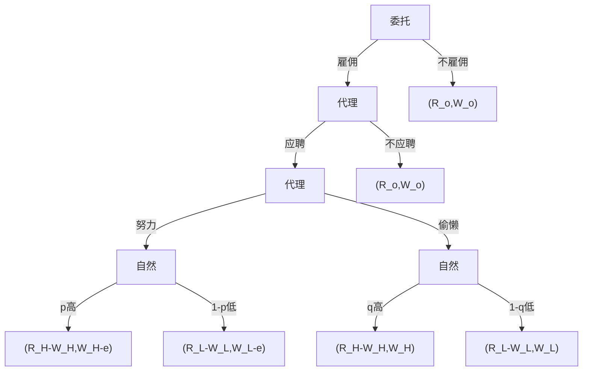
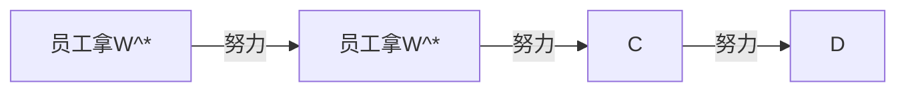
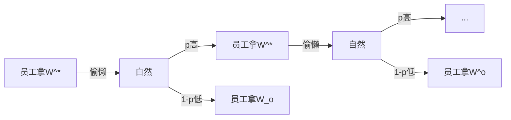

##### Contents

## 时间地点

11.20，第12周周三，晚 5:50-7:50，带有照片证件

## 考纲

基本概念

- 静态博弈、动态博弈、完全（不完全）信息、完美（不完美）信息
- 纳什均衡、逆向选择、道德风险
- 海萨尼转换
- 信号传递、信号甄别

基本方法

- 收益矩阵分析
- 博弈树分析
  - 单一价格旧车模型：一个饭店推出高价外卖
  - 委托代理模型：代理的努力程度与工作结果关系不确定、且委托无法监督代理的努力程度
  - 求贴现率 $\delta$ 使无限次重复博弈、局中人会合作（价格战、无限重复古诺模型）
- 求效率工资 $W^*$、设计使局中人说实话的机制

古诺模型

---

## 基本概念

### 静态博弈和动态博弈

静态博弈和动态博弈的分类取决于人们讨论这类问题使用的方法，而不是目标对象的运动状态。人们用静态方法讨论问题，则为静态博弈；否则为动态博弈。

静态博弈：如一博弈中，每个局中人都只有一次行为机会，且他们在信息意义下（行为前不能观测他人的行为）

动态博弈：如一博弈中，一些局中人有不只一次的行为机会，或有些局中人能在行为前预测到一些他人的行为

### 完全（不完全）信息

如一博弈中，一局中人对各种策略组合下各局中人的收益都完全了解，则称这局中人有完全信息

如一博弈中，一局中人对有些策略组合下有些局中人的收益不完全了解，则称这局中人有不完全信息

完全信息博弈：每一局中人都有完全信息

不完全信息博弈：有一局中人有不完全信息

> 便士博弈下，双方都有完全信息。博弈论的任务，预测哪个策略组合出现。

### 完美（不完美）信息

动态博弈中，轮到行为的局中人对此前已行为的局中人的所有行为能完全观测， 则称这局中人有完美信息

动态博弈中，轮到行为的局中人对此前已行为的有些局中人的行为不能完全观测，则称这局中人有不完美信息

> 行为只看完美（不完美）
>
> 收益只看完全（不完全）

### 纳什均衡

一博弈中，如存在一策略组合，单个局中人独自离开策略组合（选择其他策略组合而不是离开博弈），其收益不会增加，则称这策略组合为这一博弈的纳什均衡

### 逆向选择和道德风险

对某个对象（事物、问题），双方知道的一样多，则称为信息对称；一方知道的多，一方知道的少，则称为信息不对称

信息不对称发生在签约前或交易前，称为事前信息不对称

研究事前信息不对称的理论或模型称为逆向选择

研究事后信息不对称的理论或模型称为道德风险

> 旧车模型：好车离开市场，差车留在市场，市场让差车留下，即市场选择了差车。

### 海萨尼转换

引进虚拟局中人，将虚拟局中人决定私有信息局中人的类型作为博弈的第一阶段，再进行原博弈。将对有私人信息局中人类型的不了解转换为对虚拟局中人行为的不了解，将不完全信息转换为不完美信息

### 信号传递和信号甄别

有私人信息局中人的先行为模型称为信号传递

有私人信息局中人的后行为模型称为信号甄别

> 1 求职者，2 雇主
>
> 信号传递
>
> 1. “自然”确定求职者能力“强”“弱” —— 海萨尼转换
> 2. **求职者选定受教育水平 —— 有私人信息局中人先行为**
> 3. **两雇主各定与受教育水平及工作效果有关的合同**
> 4. 求职者接受一合同或拒绝所有的合同
> 5. 结果
>
> 信号甄别
>
> 1. “自然”确定求职者能力“强”“弱” —— 海萨尼转换
> 2. **两雇主各定与受教育水平及工作效果有关的合同**
> 3. **求职者选择受教育水平 —— 有私人信息局中人后行为**
> 4. 求职者接受一合同或拒绝所有的合同
> 5. 结果

## 基本方法

### 收益矩阵分析

### 古诺模型的推导

不合作
$$
\pi_1=q_1(8-(q_1+q_2))-q_12\\
\pi_2=q_2(8-(q_1+q_2))-q_22\\
\downarrow\\
\frac{\partial\pi_1}{\partial q_1}=0,\frac{\partial\pi_2}{\partial q_2}=0\\
\downarrow\\
6-2q_1-q_2=0,6-2q_2-q_1=0\\
\downarrow\\
q_1=\frac{6-q_2}{2},q_2=\frac{6-q_1}{2}\\
\downarrow\\
q_1=q_2=2\\
\downarrow\\
\pi_1=\pi_2=4
$$
合作
$$
\pi=q(8-q)-q2=6q-q^2\\
\downarrow\\
\frac{\partial\pi}{\partial q}=6-2q\\
\downarrow\\
q=3,q_1=q_2=1.5\\
\downarrow\\
\pi=9,\pi_1=\pi_2=4.5
$$
合作但背叛
$$
\pi_2=q_2(8-(q_2+1.5))-q_22=4.5q_2-q_2^2\\
\downarrow\\
\frac{\partial\pi_2}{\partial q_2}=4.5-2q_2\\
\downarrow\\
q_1=1.5,q_2=2.25\\
\downarrow\\
\pi_2=5.0625,\pi_1=1.5(8-(1.5+2.25))-3=3.375
$$
最终得到的收益矩阵
$$
\begin{bmatrix}
& 合作 & 不合作 \\
合作 & (4.5,4.5) & (3.375,5.0625) \\
不合作 & (5.0625,3.375) & (4,4) \\
\end{bmatrix}
$$

### 博弈树分析

#### 无限重复的古诺模型

$$
\begin{bmatrix}
& 合作 & 不合作 \\
合作 & (4.5,4.5) & (3.375,5.0625)\\
不合作 & (5.0625,3.375) & (4,4)
\end{bmatrix}
$$

如果选择合作
$$
PV=[4.5,4.5\delta,4.5\delta^2,\dots,4.5\delta^{n-1}]\\
\downarrow\\
TPV=\frac{4.5}{1-\delta}
$$
如果选择不合作
$$
PV=[5.0625,4\delta,4\delta^2,\dots,4\delta^{n-1}]\\
\downarrow\\
TPV=5.0625+\frac{4(\delta-\delta^{n})}{1-\delta}=5.0625+\frac{4\delta}{1-\delta}
$$
如果合作的总现值大于不合作的总现值，选择合作
$$
\frac{4.5}{1-\delta}\gt 5.0625+\frac{4\delta}{1-\delta}\\
4.5\gt 5.0625-5.0625\delta+4\delta\\
1.0625\delta\gt0.5625\\
\delta\gt\frac{0.5625}{1.0625}=\frac{9}{17}
$$
当 $\delta\gt\frac{9}{17}$ 时选择合作，否则选择不合作

---

如果选择不合作，也就是 $\delta\lt\frac{9}{17}$

1. 各产产量 $d$，$1.5\lt d\lt 2$，实现低水平合作
   $$
   \pi_1=\pi_2=d(8-2d)-2d=-2d^2+6d
   $$

2. 一人产 $d$，另一人产 $q_2$
   $$
   \pi_2=q_2(8-(d+q_2))-2q_2=-q_2^2+6q_2-dq_2\\
   \downarrow\\
   \frac{\partial \pi_2}{\partial q_2}=-2q_2+6-d=0\rightarrow q_2=\frac{6-d}{2}\\
   \downarrow\\
   \pi_2=\frac{(6-d)^2}{4}
   $$

如果选择低水平合作
$$
PV=[(6d-2d^2),(6d-2d^2)\delta,(6d-2d^2)\delta^2,\dots,(6d-2d^2)\delta^{n-1}]\\
\downarrow\\
TPV=(6d-2d^2)\frac{1}{1-\delta}
$$
如果选择不合作
$$
PV=[\frac{(6-d)^2}{4},4\delta,4\delta^2,\dots,4\delta^{n-1}]\\
\downarrow\\
TPV=\frac{(6-d)^2}{4}+4\frac{\delta}{1-\delta}
$$
如果合作的总现值大于不合作的总现值，选择合作
$$
(6d-2d^2)\frac1{1-\delta}\gt\frac{(6-d)^2}{4}+4\frac{\delta}{1-\delta}\\
6d-2d^2\gt\frac{1}{4}(36+d^2-12d)(1-\delta)+4\delta\\
6d-2d^2\gt 9-9\delta+\frac14d^2-\frac14d^2\delta-3d+3d\delta+4\delta\\
24d-8d^2\gt36-36\delta+d^2-d^2\delta-12d+12d\delta+16\delta\\
0\gt (9-\delta) d^2+(12\delta-36)d+(36-20\delta)\\
0\gt[(9-\delta)d+(-18+10\delta)][(d+(-2)]
$$
如果 $(9-\delta)d+(10\delta-18)\gt 0$ 选择合作
$$
d\gt\frac{18-10\delta}{9-\delta}=\frac{90-10\delta-90+18}{9-\delta}=10-\frac{72}{9-\delta}\\
\downarrow\\
2\gt\frac{18-10\delta}{9-\delta}\\
$$

#### 价格战

收益矩阵
$$
\begin{bmatrix}
& 高 & 低 \\
高 & (4,4) & (0,5) \\
低 & (5,0) & (1,1) \\
\end{bmatrix}
$$
选择合作
$$
PV=[4,4\delta,4\delta^2,\dots,4\delta^{n-1}]
$$

$$
V_e=\frac{4}{1-\delta}
$$

选择不合作
$$
PV=[5,\delta,\delta^2,\dots,\delta^{n-1}]
$$

$$
V_c=5+\frac{\delta}{1-\delta}
$$

如果要选择合作
$$
\frac{4}{1-\delta}\gt 5+\frac{\delta}{1-\delta}\\
4\gt5-5\delta+\delta\\
\delta\gt\frac14
$$

#### 单一价格旧车模型

甲 $P$ $C$

乙 $V_H$ $V_L$

逆推归纳法

**第三阶段 对乙**

买的期望收益
$$
p(V_H-P)+(1-p) (V_L-P)
$$
不买的期望收益
$$
p0+(1-p)0=0
$$
如果要买
$$
pV_H-pP+V_L-P-pV_L+pP\gt0\\
pV_H+(1-p)V_L\gt P
$$
**第二阶段 对甲**

如果 $P-C\gt0$，甲会选择伪装

#### 委托代理模型

代理的努力程度与工作结果关系不确定、且委托无法监督代理的努力程度

逆推归纳法

**第四阶段 自然决定不考虑**

**第三阶段 对代理**

选择努力的期望收益
$$
p(W_H-e)+(1-p)(W_L-e)
$$
选择偷懒的期望收益
$$
qW_H+(1-q)W_L
$$
如果选择努力
$$
pW_H-pe+W_L-e-pW_L+pe\gt qW_H+W_L-qW_L\\
pW_H-qW_L\gt qW_H-qWL+e\\
(p-q)(W_H-W_L)\gt e\\
W_H-W_L\gt\frac{e}{p-q}
$$
**第二阶段 对代理**

选择应聘的期望收益
$$
p(W_H-e)+(1-p)(W_L-e)
$$
选择不应聘的期望收益
$$
W_o
$$
如果选择应聘
$$
pW_H+(1-p) W_L\gt W_o+e
$$
**第一阶段 对委托**

选择雇佣的期望收益
$$
p(R_H-W_H)+(1-p)(R_L-W_L)
$$
选择不雇佣的期望收益
$$
R_o
$$

#### 效率工资 $W^*$

**员工选择努力**

$$
PV=[W^*-e,(W^*-e)\delta,\dots,(W^*-e)\delta^{n-1}]
$$

$$
TPV=\frac{(W^*-e)(1-\delta^n)}{1-\delta}=\frac{W^*-e}{1-\delta}
$$

两阶段博弈
$$
V_e=W^*-e+V_e\delta\rightarrow V_e=\frac{W^*-e}{1-\delta}
$$
**员工选择偷懒**

$$
V_s=W^*+\delta(pV_s+(1-p)\frac{W_o}{1-\delta})\\
V_s=\frac{1}{1-p\delta}(W^*+(1-p)\delta\frac{W_o}{1-\delta})
$$

让员工选择努力
$$
\frac{W^*-e}{1-\delta}\gt\frac{1}{1-p\delta}(W^*+(1-p)\delta\frac{W_o}{1-\delta})\\
(W^*-e)(1-p\delta)\gt W^*-\delta W^*+\delta W_o-p\delta W_o\\
W^*-e-p\delta W^*+pe\delta\gt W^*-\delta W^*+\delta W_o-p\delta W_o\\
W^*(\delta-p\delta)+W_o(p\delta-\delta)\gt e (1-p\delta)\\
W^*-W_o\gt e\frac{1-p\delta}{\delta-p\delta}\\
W^*\gt W_o+e\frac{1-p\delta+\delta-\delta}{\delta-p\delta}\\
W^*\gt W_o+e(\frac{\delta-p\delta}{\delta-p\delta}+\frac{1-\delta}{\delta-p\delta})\\
W^*\gt W_o+e+e\frac{\frac{1}{\delta}-1}{1-p}
$$

- $W_o$ 平均工资
- $e$ 努力成本
- $e\frac{\frac{1}{\delta}-1}{1-p}$ 补贴

努力成本大，补贴就大

$\delta$ 大，补贴就小（物价涨幅小，补贴小）

$p$ 大，补贴小 （偷懒后高产的概率小 -> 容易分辨是否努力）

#### 使局中人说实话机制

> 直接机制：内心的估价
>
> 间接机制：付款额
>
> 说实话机制：说出内心的估价，说实话的直接机制
>
> 任一贝叶斯博弈的贝叶斯均衡都可由一说实话的直接机制来实现

例：甲有一画要卖，A、B 两人要买。甲想了解 A、B 对画的真实评价。

甲设计

1. A、B 各报价 $x$ 和 $y$
2. A 得画的概率 $x=\frac{x}{x+y}$，B 得画的概率 $y=\frac{y}{x+y}$
3. A 得画付款 $kx$，B 得画付款 $ly$

设 A 的内心真实估价为 $a$，$x=ta$，不得画不付款

A 的期望收益
$$
\pi_A=x(a-kx)+(1-x)0=ta(a-kta)=ta^2-kt^2a^2\\
\downarrow\\
\frac{\partial \pi_A}{\partial t}=a^2-2ka^2t=0\\
\downarrow\\
t=\frac{1}{2k}
$$
甲要 A 说实话，也就是 $t=1$，需要设置 $k=\frac12$

